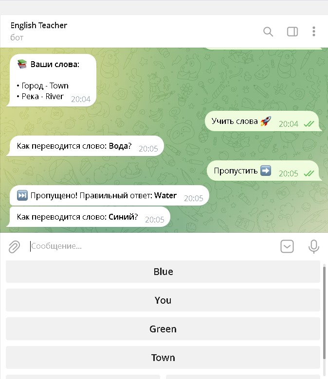

# Telegram English-Teacher Bot

## Описание:
**Бот** для **изучения английских слов** с _персональными и системными наборами слов_. Поддерживает **добавление**, **удаление** и **изучение** слов через интерактивный квиз.

## Основные функции:

- приветственное сообщение при запуске;
- квиз с 4-мя вариантами ответа на английском;
- подтверждение при правильном ответе;
- повторная попытка при неправильном ответе;
- добавление новых слов (персонально для пользователя);
- удаление слов (только из личного словаря);
- просмотр личного словаря;
- общий набор из 10 слов (цвета, местоимения, базовые слова).

### Схема БД:  

users (user_id, username, created_at)

words (word_id, user_id, russian, english, added_at)

## Требования:  

Python 3.8+
PostgreSQL

## Установка и запуск:  

1) Создайте БД выполнив запрос: ``CREATE DATABASE english-bot`` для *DBeaver* или ``createdb -U postgres english_bot`` в *терминале*.
2) Установите зависимости:  ``pip install -r requirements.txt``
3) Настройте .env файл с переменными:

   ```BOT_TOKEN=your_bot_token
   DB_NAME=english_bot
   DB_USER=postgres
   DB_PASSWORD=your_password
   DB_HOST=localhost
   DB_PORT=5432
4) Запустите бота:  ``python main.py``


## Использование:

- Запустите бота командой /start
- Выберите "Учить слова 🚀" для квиза
- Используйте "Добавить слово ➕" для добавления новых слов
- Используйте "Удалить слово 🔙" для удаления своих слов
- Просмотрите свой словарь с помощью "Мой словарь 📚"

## Скриншот (пример использования)

